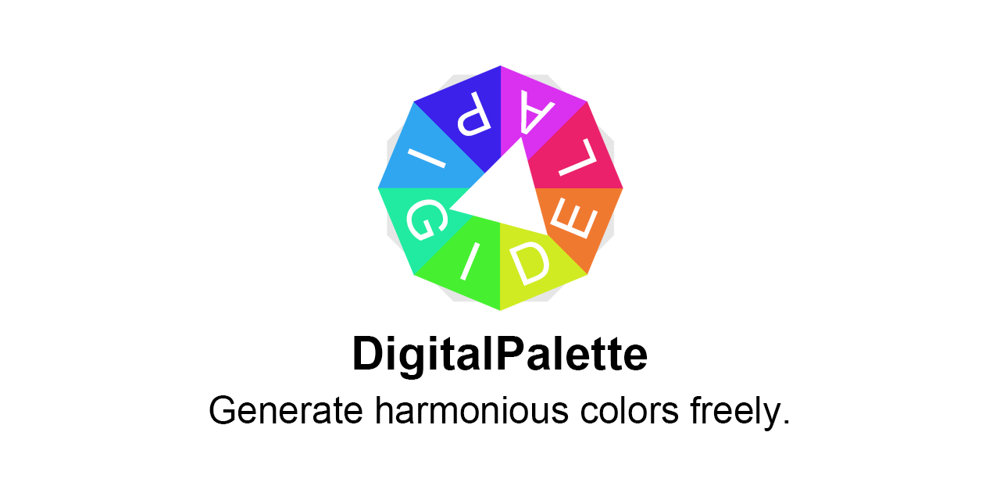

# DigitalPalette

DigitalPalette icon.

' width='90%'></img>

# Introduction
DigitalPalette is a free software for generating a set of harmonious colors from a color wheel or an existed image and applying it into your creative works.

# Home Page
The home page of DigitalPalette has been migrated to <a href="https://eigenmiao.github.io/digipale/"> https://eigenmiao.site/digipale/</a>. Please visit this site for more information.

DigitalPalette 的主页已迁移至 <a href="https://eigenmiao.github.io/digipale/"> https://eigenmiao.site/digipale/</a>。请访问此网站以获取更多信息。

# Repository
[Source Code](https://github.com/liujiacode/DigitalPalette)

# Author
[Eigenmiao](mailto:eigenmiao@outlook.com)

# Copyright
Copyright © 2019-2020 [Eigenmiao](mailto:eigenmiao@outlook.com). All Rights Reserved.

# License
DigitalPalette is a free software, which is distributed in the hope that it will be useful, but without any warranty. You can redistribute it and/or modify it under the terms of the GNU General Public License as published by the Free Software Foundation. See the [GNU General Public License 3.0 (GPL 3.0)](https://www.gnu.org/licenses/) for more details.

All images (including logo and sample images, etc.), documents and translations in DigitalPalette [code repository](https://github.com/liujiacode/DigitalPalette) are licensed under [Creative Commons Attribution-NonCommercial-ShareAlike License 4.0 (CC BY-NC-SA 4.0)](https://creativecommons.org/licenses/by-nc-sa/4.0/) unless stating additionally.
