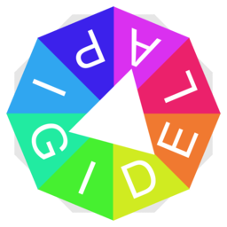

# DigitalPalette

DigitalPalette is a free software for generating a set of harmonious colors from a color wheel or an existed image and applying it into your creative works.

# Repository
[Source Code](https://github.com/liujiacode/DigitalPalette)

# Version
[2.2.8 Preview](https://github.com/liujiacode/DigitalPalette/releases/tag/v2.2.8-pre)

# Author
[Eigenmiao](mailto:eigenmiao@outlook.com)

# Copyright
Copyright © 2019-2020 [Eigenmiao](mailto:eigenmiao@outlook.com). All Rights Reserved.

# License
DigitalPalette is a free software, which is distributed in the hope that it will be useful, but without any warranty. You can redistribute it and/or modify it under the terms of the GNU General Public License as published by the Free Software Foundation. See the [GNU General Public License 3.0 (GPL 3.0)](https://www.gnu.org/licenses/) for more details.

All images (including logo and sample images, etc.), documents and translations in DigitalPalette [code repository](https://github.com/liujiacode/DigitalPalette) are licensed under [Creative Commons Attribution-NonCommercial-ShareAlike License 4.0 (CC BY-NC-SA 4.0)](https://creativecommons.org/licenses/by-nc-sa/4.0/) unless stating additionally.

# Updates
* 2020.05.16 (v2.2.8-pre): Release the preview version (2.2.8) of DigitalPalette.
* 2020.08.02 (v2.2.9-dev): Update version verification methods. Add sync rules and channels. Update operation seq. Update image home method. Add color signs. Update shortcuts. Update color sync methods.
